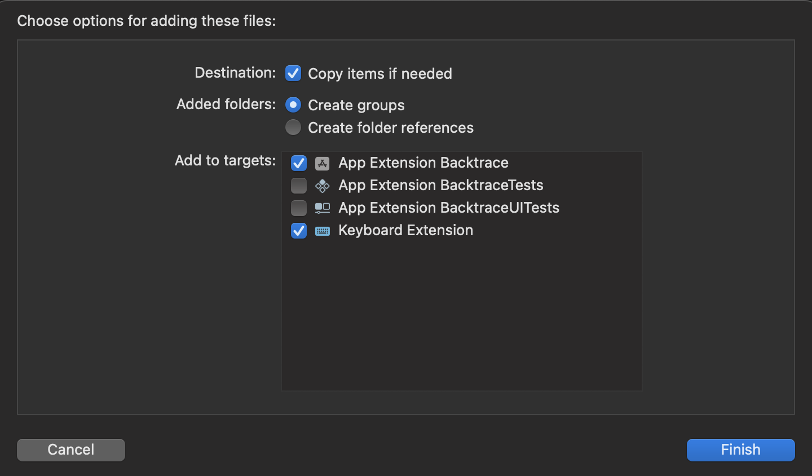

# Error and Crash Reporting in iOS App Extensions with Backtrace
We are living in times where richer inter-app communication and tighter integration with the OS services is available in mobile, and iOS is no exception. [iOS App extensions](https://developer.apple.com/app-extensions/) enable you to extend your reach beyond the process presenting the UI. You can capture screen, intercept network or interact with an Apple Watch while other apps are running in foreground. These extensions run in their own, sandboxed processes, thus require extra care to monitor them in production. In this post, we are going to take a look at how Backtrace SDK can help us in our example Keyboard Extension.

You can find a pair of sample projects below if you prefer jumping right into it.

- [Sample Project with Keyboard Extension](./App%20Extension%20without%20Backtrace/)
- [Sample Project with Keyboard Extension + Backtrace SDK](./App%20Extension%20with%20Backtrace/)

## Requirements

We'll need the latest Xcode and **backtrace-cocoa** SDK. CocoaPods CLI is not required.

## Steps

### Download SDK

Download the latest archive from backtrace-cocoa [releases](https://github.com/backtrace-labs/backtrace-cocoa/releases/). Make sure you pick `bitcode=YES embedded=YES` flavor.

Launch your Xcode project.

Copy these into your project root by drag and dropping them into **Project Navigator**.

- Rome/Backtrace.framework
- Rome/Backtrace_PLCrashReporter.framework
- Rome/Cassette.framework

Select your app and all extensions in the prompted dialog.



### Configure Xcode Project

Navigate to each build target's **General** settings (i.e your app and each extension). 

Locate **Framework, Libraries, and Embedded Content** for apps and **Frameworks and Libraries** for extensions.

Add all the new frameworks to your targets if missing. Set embedding settings as **Embed Without Signing**.

Navigate to **Build Phases->Embed Frameworks** and make sure all the frameworks are added there. (app and extension targets)

Navigate to **Build Settings** and change **Debug Information Format** to `Dwarf with dSYM File`. (app and extension targets)

### Add Sources

Create a new directory with **Finder** in your project and name it **Backtrace**.

Copy all ".h" files in `Backtrace.framework/Headers` and `Backtrace_PLCrashReporter.framework/Headers` into newly created directory.

Go back to Xcode and add **Backtrace** by drag & dropping it into **Project Navigator**. If you get prompted to add bridging header files, accept it.

Make sure files are added to all targets in the prompted dialog.

Create a new Obj-C class in your project, i.e `BacktraceWrapper.h` and `BacktraceWrapper.m`. Let Xcode create bridging headers for the targets that utilize Swift if asked.

#### BacktraceWrapper.h
```objective-c
#import <Foundation/Foundation.h>

NS_ASSUME_NONNULL_BEGIN

@interface BacktraceWrapper : NSObject

+(void)sendError:(NSError*)error attributes:(NSDictionary*)extra;

@end

NS_ASSUME_NONNULL_END
```

#### BacktraceWrapper.m
```objective-c
#import "BacktraceWrapper.h"
#if defined(__arm64__) && __arm64__
#import "Backtrace-Swift.h"
#import "Backtrace-PLCrashReporter-umbrella.h"
#endif

@implementation BacktraceWrapper

#pragma mark Globals
#if defined(__arm64__) && __arm64__
static BacktraceClient* client;
#endif

#pragma mark Private

+(void)initializeBacktrace {
#if defined(__arm64__) && __arm64__
    if (client != nil) {
        return;
    }
    
    BacktraceCredentials* credentials = [[BacktraceCredentials alloc] initWithSubmissionUrl: [NSURL URLWithString: @"https://submit.backtrace.io/BACKTRACE_SUBDOMAIN/BACKTRACE_SUBMISSION_TOKEN/plcrash"]];
    
    BacktraceDatabaseSettings *dbSettings = [[BacktraceDatabaseSettings alloc] init];
    dbSettings.maxRecordCount = 10;
      
    BacktraceClientConfiguration *configuration = [[BacktraceClientConfiguration alloc]
                                                initWithCredentials: credentials
                                                dbSettings: dbSettings
                                                reportsPerMin: 30 // Default is 30
                                                allowsAttachingDebugger: FALSE // If false, disables backtrace during development
                                                detectOOM: FALSE];
    
    
    BacktraceCrashReporter* crashReporter = [[BacktraceCrashReporter alloc] initWithConfig: PLCrashReporterConfig.defaultConfiguration];
    client = [[BacktraceClient alloc] initWithConfiguration:configuration crashReporter:crashReporter error:nil];
    
    [client.metrics enableWithSettings:[[BacktraceMetricsSettings alloc] init]];
#endif
}


#pragma mark Public

+(void)sendError:(NSError*)error attributes:(NSDictionary*)extra {
#if defined(__arm64__) && __arm64__
    [self initializeBacktrace];
    [client sendWithError:error attachmentPaths:@[] completion:^(BacktraceResult * _Nonnull result) {
        NSLog(@"Backtrace error sent: %@", [error description]);
    }];
#endif
}

@end
```

### Swift support
If you want to expose `BacktraceWrapper` to your swift files, add the following line to your bridging headers.

```objective-c
#import "BacktraceWrapper.h"
```

`BacktraceWrapper.sendError(error: Error)` will become available to your swift code.

### Upload symbols with CI
Once you are ready to distribute your app, run the commands below in your CI to upload debug symbols to Backtrace.

```shell
cd $DERIVED_DATA_PATH/Build/Products/Debug-iphoneos/

zip -r symbols.zip *.dSYM
curl --fail-with-body --data-binary @symbols.zip -X POST -H "Expect: gzip" "https://submit.backtrace.io/$BACKTRACE_SUBDOMAIN/$BACKTRACE_SYMBOLS_ACCESS_TOKEN/symbols"
```

## Final Words

From now on, you can enjoy the same error reporting capabilities your app enjoyed in your extensions!

Until next time, peace <3